# PAG
Proyecto de la asigantura de Programacion de aplicaciones graficas. 4º año Ingenieria Informatica

# Reflexion sesion 1

yo creo que la clase renderer se deberia de implementar como una clase normal, que tenga un atributo que sea un puntuero a si mismo. Asi si se llama desde cualquier metodo, al invocarlo ya tendriamos acceso a la clase completa y al propio metodo para recargar el renderer desde los callbacks.

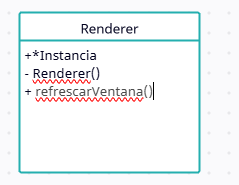

# Ejercicio 5 Sesion 3

### Si redimensionas la ventana de la aplicación, verás que el triángulo no permanece igual, sino que se deforma al mismo tiempo que la ventana. ¿A qué crees que se debe este comportamiento? 

Creo que este comportamiento se debe al proceso de pipeline que estamos haciendo, ya que se llama al view port para rescalado al mover el tamaño pero en el codigo, no se vuelve a aplicar la transformacion de visualizacion ni la transformación de proyección, deformando asi el triangulo

# Ejercicio 5 Sesion 5

Para aplicar la camara he creado una nueva clase camara con los parametros correspondientes a ella y los metodos para sus respectivos movimientos. He añadido además dos metodos qeu devuelven la matriz de proyeccion y la matriz de vision para facilitar las cosas.

Se conecta de manera que el renderer tiene un atributo camara. El controlador del imgui tiene nuevos parametros para el uso de la camara y tiene dos funciones nuevas, una que es unicamente para dibujar la ventana y la seleccion del movimiento de la camara y la otra que es para aplicar dicho movimiento llamando a la camara del renderer.

He tenido que añadir tambien un callback nuevo para trackear la posicion del raton y modificar el de pulsar el raton para que solo realice movimiento si el raton no se esta usando en el imgui. El propio callback de la posicion es el que llama al aplicar movimiento ya que es el que puede pasarle los parametros x e y.

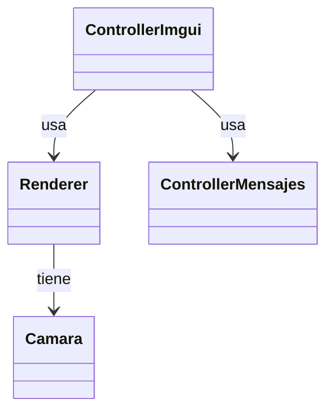

# Sesion 6

Para empezar el Assimp no me funciona con el conan y me esta dando muchos problemas asi que voy a usar la libreria tinyobjloader

Vamos a tener en la clase del renderer un vector con punteros unicos a cada modelo cargado, de manera que podamos tener varios a la vez

He usado un unordered map para almacenar los vertices al importarlos del modelo para asi evitar los duplicados 

Nuevo archivo de shaders en esta practica la pag06 y ya se les pasan las 3 matrices Modelado, vision y proyeccion y la matriz conjunta mvp para ahorrar calculos

# Sesion 7

Para introducir los materiales, el renderer va a tener un mapa con los materiales que se creen y la clase modelo va a tener un campo que va a almacenar el nombre de ese material. Asi varios modelos pueden usar el mismo material

# Sesion 10

Como estoy usando el tinyOBJLoader en vez de el Assimp no me autogestiona las tangentes ni las bitangentes, por tanto en modelo he creado un método para calcularlas y al que se llamara cuando se cargue el modelo.

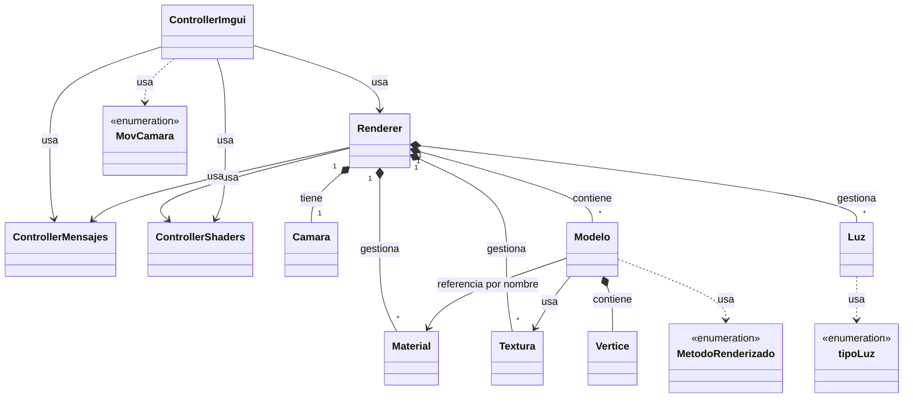

---
# Manual de usuario

## Ejemplo de ejecución:

- Cargamos el shader del mapa de sombras
- Cargamos el shader que toca (Shaders/pag10)
- Cargamos el modelo del Trex
- Creamos un material
- Se lo aplicamos al modelo del Trex
- Creamos una luz direccional
- Le asignamos al Trex una textura
- Le asignamos al Trex su textura de normal mapping
- Ponemos al Trex en el modod de visualizacion deseado
- Añadimos el modelo de la vaca
- Le asignamos el mismo material
- Le asignamos a la vaca su textura
- Cambiamos a textura el modo de visualizacion de la vaca
- Desplazamos la vaca hacia un lateral
- Activamos la sombras

## Ventanas:

El programa consta de varias ventanas las cuales vienen explicadas en este manual:

### La consola

En esta ventana apareceran los mensajes de error que tenga la aplicación. También apareceran varios mensajes de confirmacion cuando se realicen ciertas acciones (un ejemplo al activar las sombras).

Empezará mostrando el nombre de la aplicacion asi como las características de nuestra gráfica.

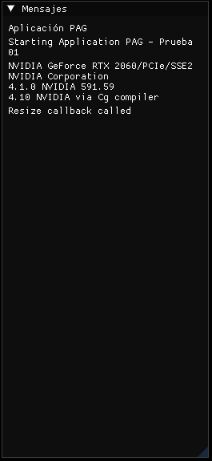

### Selector de color de fondo

Pues es un selector de color de fondo sin mas, seleccionas con el ratón y cambias el color del fondo.

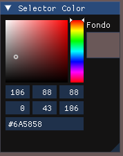

### Gestor Shaders

Es la ventana encargada de cargar y crear los shaders.

Cuenta con dos botones uno para cargar el shader principal que automaticamente lo pone como shader activo, y otro boton para cargar el de sombras que simplemente lo carga, no lo pone como activo.

**IMPORTANTE**: todos los shaders estan dentro de la carpeta Shaders del programa por tanto hay que poner siempre la dirección de la carpeta y no lo he podido comprobar pero creo que en linux hay que cambiar el / por el \ .

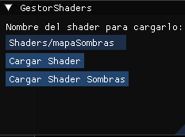

### Gestion de la camara

La camara funciona con el ratón, haciendo click izquierdo y se configura en esta ventana.

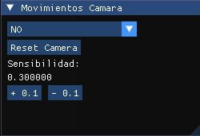

Podemos hacer los siguientes movimientos:

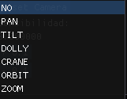

#### No

No permite que la camara se mueva ni haga nada al pulsar con el ratón.

#### PAN

Rota el punto al que mira la cámara de manera horizontal.

#### TILT

Rota el punto al que mira la cámara de manera vertical.

#### DOLLY

Mueve todo la cámara y el punto al que mira en el eje Z y X

#### CRANE

Mueve todo la cámara y el punto al que mira en el eje Y

#### ORBIT

Gira la cámara alrededor del punto al que mira en todas las direcciones.

#### ZOOM

Cambia el fov para ampliar o reducir la imagen.

### Carga de Modelos

En esta ventana podremos seleccionar el modelo y cargarlo dandole a añadir modelo. Posteriormente cuando haya uno o varios modelos, podremos seleccionar uno y borrarlo.

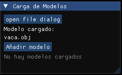

Si le damos al open file dialog, se abrirá la siguiente pestaña que nos permitirá navegar y seleccionar un modelo de nuestro sistema de archivos.

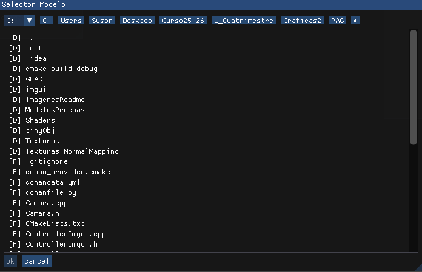

Si pulsamos cancel se cirra.
Una vez que lo tenemos selecionado le damos a ok y vemos como cambia el modelo seleccionado en al ventana.

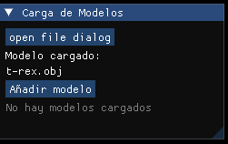

Añadimos el modelo y deberia de verse asi:

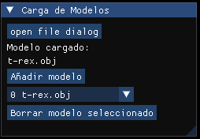

*BUG: si por algun casual al añadir esta como en la siguiente foto se soluciona abriendo el selector y seleccionando el modelo*

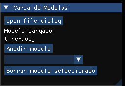

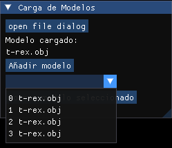

### Modificar Modelo

En esta ventana podremos configurar casi todos los parametros del modelo, salvo las texturas que se hacen en ventanas aparte.

**IMPORTANTE** Las transformaciones del modelo son sliders aunque tengan valor numerico, click izquierdo en el y desplazas el ratón izquierda y derecha tanto en la translación como en el escalado. La rotación si se puede hacer introduciendo el valor exacto.

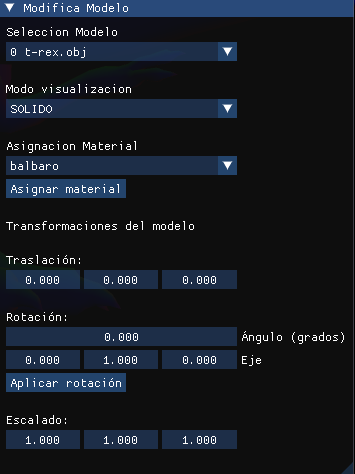

Como podemos ver en la ventana tenemos una lista para selecionar el modelo actual, despues tenemos el metodo de visualización, la asignacion de un material seleccionado y por ultimo transfomaciones del modelo.

Diferentes modos de visualizacion:

(Al metodo de alambre no le afecta la luz)

ALAMBRE SIN MATERIAL 

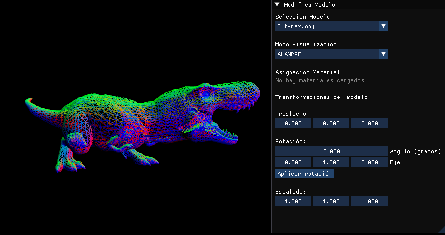

ALAMBRE CON MATERIAL BLANCO (ejemplo)

SOLIDO SIN LUZ Y SIN MATERIAL

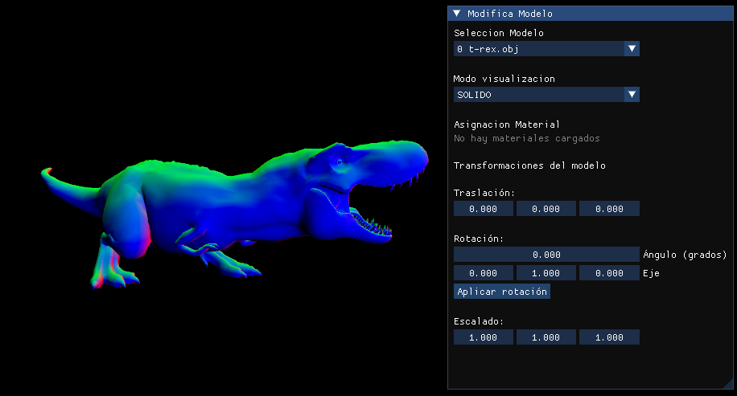

SOLIDO SIN LUZ CON MATERIAL BLANCO (ejemplo)

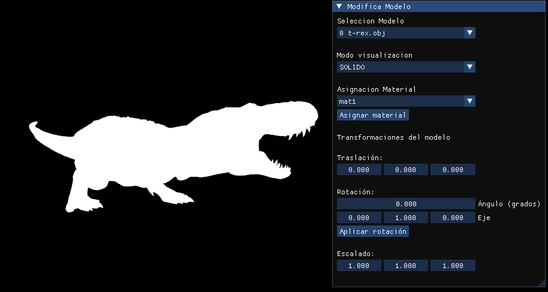

SOLIDO CON LUZ DIRECCIONAL (ejemplo) Y CON MATERIAL BLANCO (ejemplo)

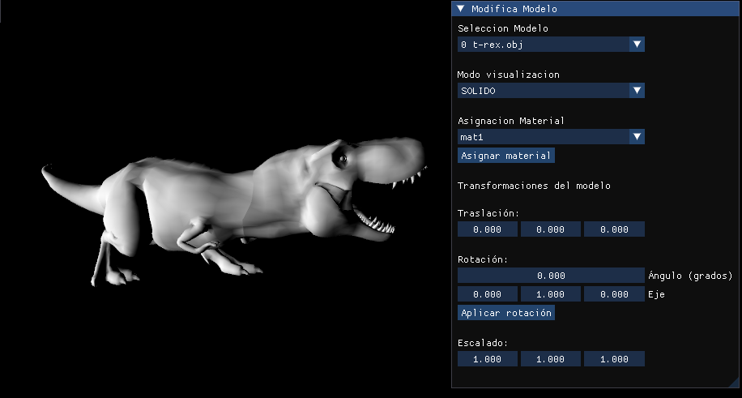

**IMPORTANTE** si se va a usar una textura con luz es necesario que tenga un material asignado para los brillos.

TEXTURA SIN LUZ 

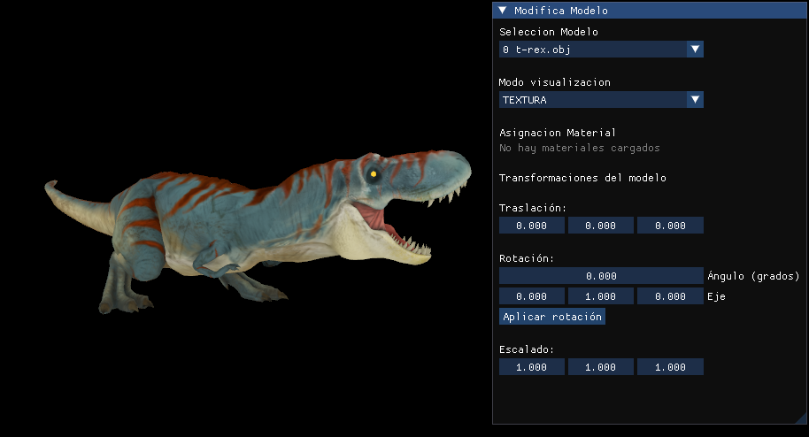

TEXTURA CON LUZ Y MATERIAL 

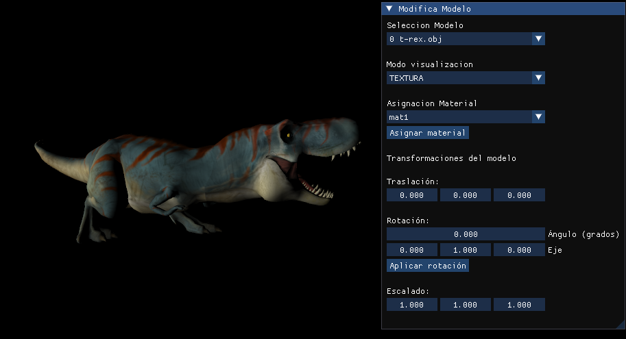

TEXTURA CON NORMAL MAPPING CON LUZ DIRECCIONAL(ejemplo) Y CON MATERIAL (ejemplo)

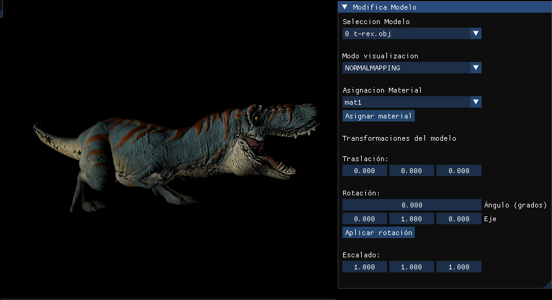

### Gestion Materiales

En esta ventana podremos Crear, Modificar y Borrar los materiales.

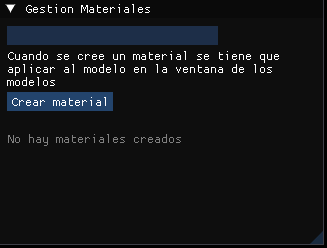

Una vez que hemos escrito el nombre del material y lo hemos creado ahora podemos cambair sus parametros, con 3 selectores de color y un slider para el exponente especular.

Tenemos tambien un selector en caso de que haya varios materiales, seleccionar cual queremos modificar.

Como ya existe un material tambien podemos borrar el material que esta seleccionado.

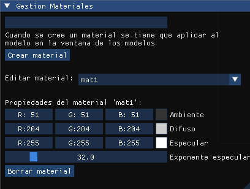

### Gestion Texturas

En esta ventana podremos cargar las texturas con el sistema de archivos y asignarlas al modelo deseado.

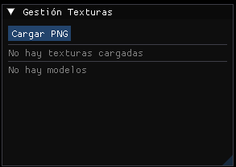

Cuando pulsamos el cargar se abre el selector de archivos que vimos anteriormente.

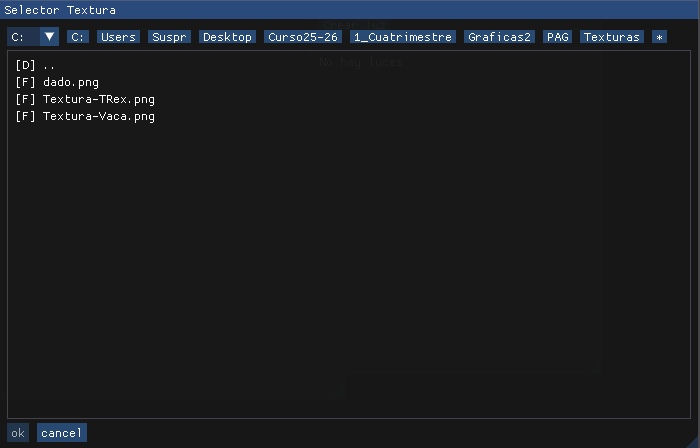

Cuando le damos a ok se carga la textura directamente.

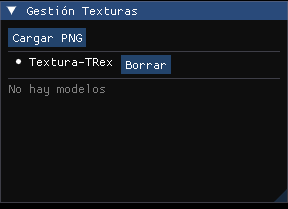

La propia ventana nos muestra las texturas que hay.

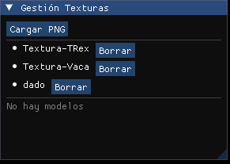

Cuando hay modelos cargados nos permite seleccionar que textura queremos asignar a que modelo.

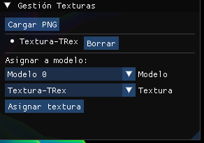

### Gestion Texturas Normal Mapping

Es una ventana exactamente igual que la de Gestion de Texturas normal.

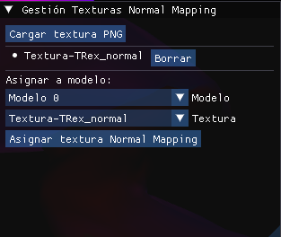

### Gestion de luces

Es una ventana donde se crean, modifican y borran los distintos tipos de luz.

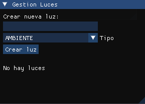

#### Luz Ambiente

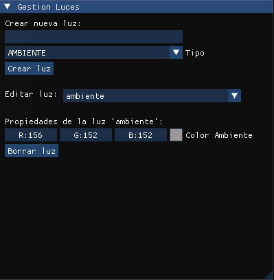

#### Luz Puntual

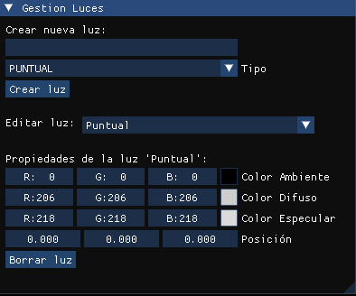

#### Luz Direccional

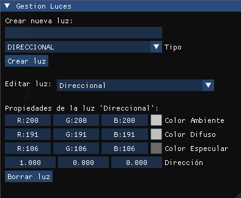

#### Luz Foco

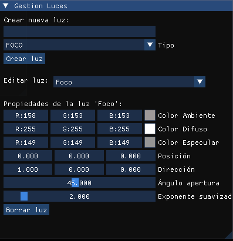

### Gestion Sombras

Esta ventana activa la visualizacion de las sombras.

**IMPORTANTE** Es necesario que se haya cargado previamente el shader del mapa de sombras para activar esta opcion  (En este caso en el texto de los shaders es Shaders/mapaSombras).

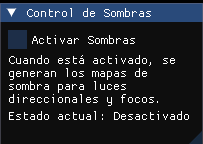

